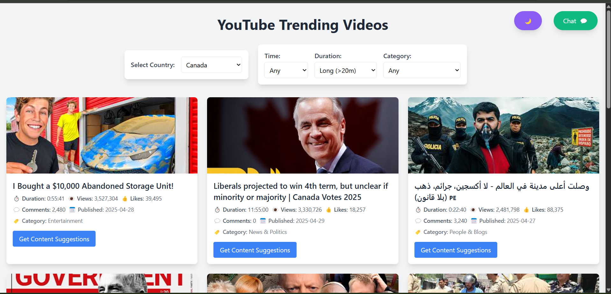

# YouTube Trending Videos & Content Suggestions

This Flask-based project provides a dynamic platform to explore trending YouTube videos while leveraging Google's Gemini AI to generate content ideas. With a modern, responsive UI featuring dark mode and an interactive chat interface, users can engage in discussions about video trends across different countries. The integration of AI-powered content suggestions helps creators and marketers develop engaging video ideas based on trending topics. This project is particularly beneficial for content creators looking to optimize their strategy, researchers analyzing video engagement metrics, and social media managers seeking data-driven insights into viral trends..



## Features

- Display current trending YouTube videos with comprehensive metrics:
  - View counts, likes, and comments
  - Video duration and publish date
  - Thumbnails and clickable titles
- AI-powered content suggestions for each video
- Interactive chat interface to discuss trends by country
- Dark mode support
- Country-specific trending videos
- Modern, responsive UI using Tailwind CSS
- Engagement-based video ranking

## Prerequisites

- Python 3.7 or higher
- YouTube Data API key
- Google Gemini API key

### Gemini API
- Requires API key for content generation
- Used for chat responses and content suggestions

## Setup

1. Clone this repository:
   ```bash
   git clone <repository-url>
   cd <repository-name>
   ```

2. Install the required packages:
   ```bash
   pip install -r requirements.txt
   ```

3. Create a `.env` file in the root directory:
   ```
   YOUTUBE_API_KEY=your_youtube_api_key_here
   GEMINI_API_KEY=your_gemini_api_key_here
   ```

4. Getting a YouTube API Key:
   - Visit the [Google Cloud Console](https://console.cloud.google.com/)
   - Create a new project or select existing one
   - Enable the YouTube Data API v3
   - Go to Credentials
   - Create an API key
   - (Optional) Restrict the API key to YouTube Data API v3

5. Getting a Gemini API Key:
   - Visit [Google AI Studio](https://makersuite.google.com/app/apikey)
   - Create an API key
   - No restrictions needed for Gemini API

## Running the Application

1. Start the Flask server:
   ```bash
   python app.py
   ```

2. Access the application:
   ```
   http://localhost:5000
   ```

## Features Guide

### Video Display
- Videos are sorted by engagement score
- Each video shows:
  - Title (clickable, opens in new tab)
  - View count, likes, comments
  - Duration and publish date
  - Thumbnail
  - Content suggestion button

### Chat Interface
- Click the chat button (top-right) to open
- Select country to discuss trends
- AI-powered responses about trends
- Chat history maintained during session

### Dark Mode
- Toggle using the theme button
- Preference saved in browser
- Affects all UI elements

### Content Suggestions
- Click "Get Content Suggestions" on any video
- AI generates related content ideas
- Considers regional preferences

## Troubleshooting

### No Videos Displaying
1. Check API Keys:
   - Verify both API keys in `.env` file
   - Ensure keys are valid and not restricted

2. Quota Issues:
   - Check terminal for quota exceeded messages
   - Wait for quota reset at midnight PT
   - Consider requesting quota increase

3. Region Issues:
   - Try different country selections
   - Check if content is restricted in your region

### Chat Not Working
1. Verify Gemini API key
2. Check terminal for error messages
3. Ensure internet connectivity

## Security Notes

- Never commit `.env` file to version control
- Keep API keys secure and private
- Consider implementing API key rotation
- Add rate limiting for production use

## Technical Details

- Flask web framework
- Tailwind CSS for styling
- YouTube Data API v3
- Google Gemini AI
- Local storage for theme preference
- AJAX for dynamic content loading

## Contributing

1. Fork the repository
2. Create a feature branch
3. Commit changes
4. Push to the branch
5. Create a Pull Request
